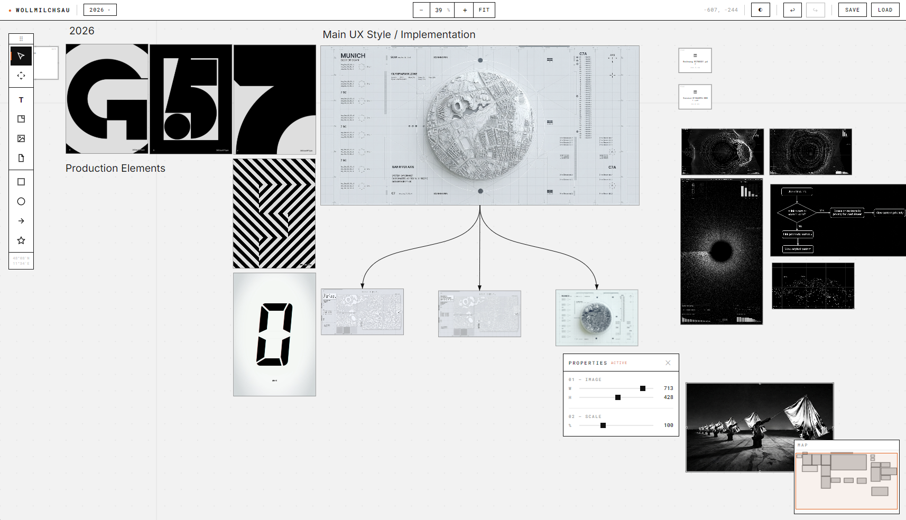

# WOLLMILCHSAU

Infinite canvas that can do it all.



## Features

- **Infinite Canvas** — Pan, zoom, dot grid, minimap
- **Images** — Drag & drop upload, resize
- **Text & Notes** — Inline editing, sticky notes with color accents
- **Shapes** — Rectangles, circles
- **Connections** — Arrows between elements
- **Icons** — Emoji picker
- **Files** — Upload & attach small files
- **Boards** — Create, switch, rename, delete multiple boards
- **Properties** — Floating popup with sliders for W/H/Scale
- **Night Mode** — Full dark theme toggle
- **Auto-save** — Every 30s, JSON-based persistence
- **Undo/Redo** — Ctrl+Z / Ctrl+Shift+Z
- **Keyboard Shortcuts** — V=Select, H=Pan, T=Text, N=Note, R=Rect, A=Arrow

## UX & Design Philosophy

The core of **WOLLMILCHSAU** is built around an uncompromising focus on flow, immediacy, and spatial freedom:

- **Unobtrusive Interface:** The UI gets out of the way. Tools and properties (like the floating W/H/Scale popup) only appear contextually when needed, maximizing the space for your ideas on the infinite canvas.
- **Immediate Feedback:** Every action, from panning the canvas to dropping an image, feels instantaneous and responsive because we rely on fast Vanilla JS and native DOM/SVG manipulations instead of heavy frameworks.
- **Keyboard-First Workflow:** True productivity comes from keeping your hands on the keyboard. With single-key shortcuts for tools (V=Select, H=Pan, T=Text, R=Rect) and robust undo/redo, you can think and map ideas at the speed of thought.
- **Visual Comfort:** Built-in Night Mode and a subtle dot grid provide structure without causing eye strain during long brainstorming or architecture sessions.

## Setup

```bash
npm install
node server.js
```

Open [http://localhost:3000](http://localhost:3000)

## Stack

Node.js + Express, Vanilla JS, SVG, no build tools.
